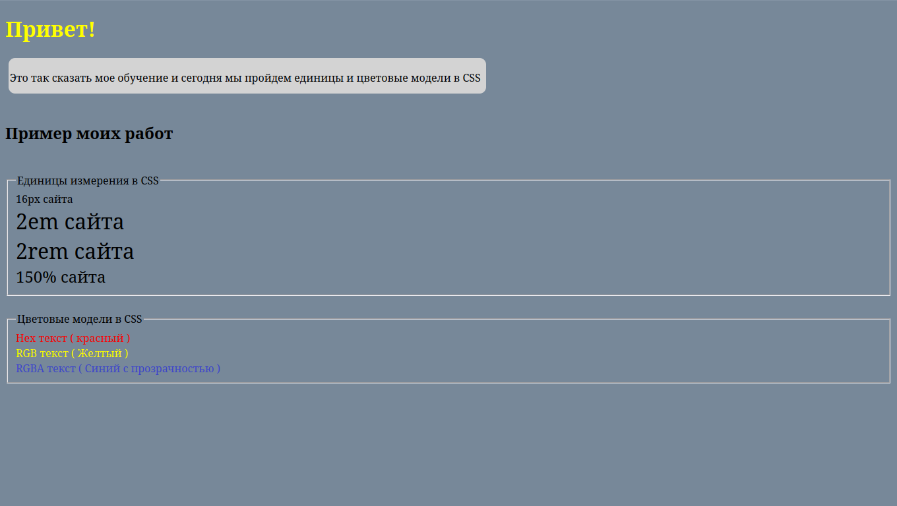

# Домашнее задание: Единицы измерения и цветовые модели в CSS

## 📌 Задание
1. Создать HTML-документ с примерами:
   - Использование единиц измерения: `px`, `em`, `rem`, `%`
   - Применение цветовых моделей: `hex`, `rgb`, `rgba`
2. Собрать все примеры в одном файле.
3. Добавить комментарии к коду.
4. Загрузить на GitHub.



---

## 🧑‍💻 Использованные технологии
- HTML5
- CSS3

---

## ✅ Примеры
- **px** – фиксированный размер (16px)
- **em** – относительный размер (2em)
- **rem** – относительный размер от корневого элемента (2rem)
- **%** – относительная величина (150%)

- **hex** – `#ff0000`
- **rgb** – `rgb(255, 255, 0)`
- **rgba** – `rgba(0, 0, 255, 0.5)` (с прозрачностью)

---

## 🚀 Как запустить
Склонировать репозиторий:
```bash
git clone https://github.com/Hiraoka-Shiroi/Learning_Front-end.git
```
```html
<!DOCTYPE html>
<html lang="en">

<head>
    <meta charset="UTF-8">
    <meta name="viewport" content="width=device-width, initial-scale=1.0">
    <title>Единицы и цветовые модели в CSS</title>
    <link rel="stylesheet" href="styles.css">
</head>

<body>

    <h1 id="h1">Привет!</h1>

    <div class="box">
        <p>Это так сказать мое обучение и сегодня мы пройдем единицы и цветовые модели в CSS</p>
    </div>

    <br>

    <h2>Пример моих работ</h2>

    <br>

    <!-- Задание 1: Работа с единицами измерения-->
    <div>
        <fieldset>
            <legend>Единицы измерения в CSS</legend>
                <div class="px">16px сайта</div>
                <div class="em">2em сайта</div>
                <div class="rem">2rem сайта</div>
                <div class="procent_Size">150% сайта</div>
        </fieldset>
    </div>

    <br>

    <!-- Задание 2: Работа с цветовыми моделями-->
    <div>
        <fieldset>
            <legend>Цветовые модели в CSS</legend>
                <div class="hex">Hex текст ( красный )</div>
                <div class="rgb">RGB текст ( Желтый )</div>
                <div class="rgba">RGBA текст ( Синий с прозрачностью )</div>
        </fieldset>
    </div>

</body>

</html>
```
```css
/* Оформление сайта */
body {
    background-color: lightslategrey;
}

.box {
    background-color: lightgrey;
    width: 720px;
    height: 50px;
    margin-left: 5px;
    padding: 2px;
    border-radius: 10px;
}


/* Задание 1 */
.px {
    font-size: 16px;
}

.em {
    font-size: 2em;
}

.rem {
    font-size: 2rem;
}

.procent_Size {
    font-size: 150%;
}


/* Задание 2 */
.hex {
    color: #ff0000;
}

.rgb {
    color:rgb(255, 255, 0);
}

.rgba {
    color: rgba(0, 0, 255, 0.5);
}


/* не важное */
#h1 {
    color:yellow;
}

#big_text {
    font-size: 32px;
}
```
