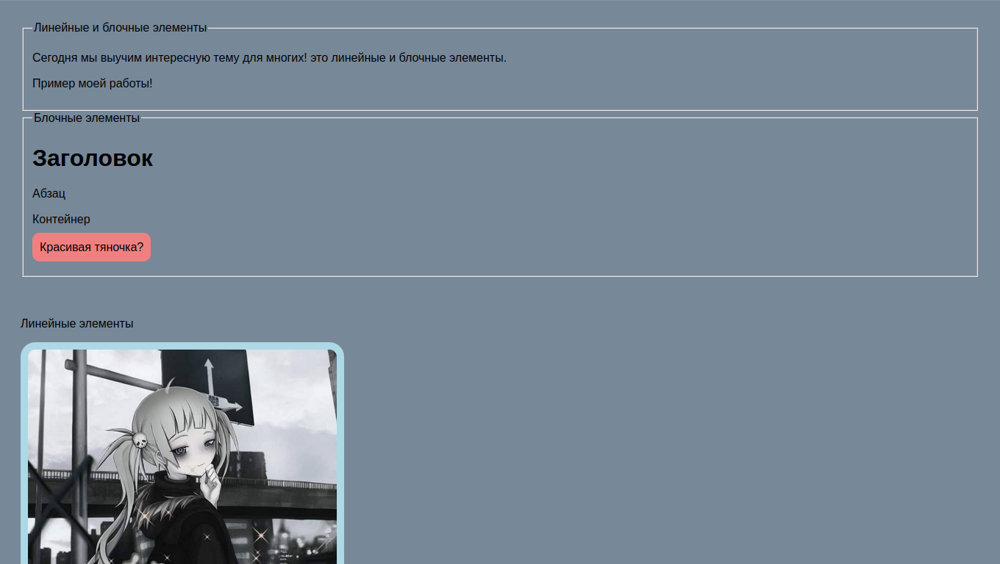

# Домашнее задание: Линейные и блочные элементы в HTML

## 📌 Задание
- Создать HTML-страницу с примерами:
  - Блочные элементы: `h1`, `p`, `div`
  - Линейные элементы: `img`, `span`, `strong`, `em`, `a`
- Для каждого элемента указать, является ли он **блочным** или **линейным** по умолчанию.
- Проверить поведение на странице:
  - Блочные — занимают всю ширину строки и переносят следующий элемент.
  - Линейные — выстраиваются в одну строку и не переносят строку.
- Преобразовать поведение некоторых элементов (показать, что inline можно сделать блочным и наоборот).
- Добавить краткие комментарии в HTML.
- Загрузить работу на GitHub.


.png)

## 🧑‍💻 Использованные технологии
- HTML5

## ✅ Примеры (что к чему относится)
**Блочные элементы по умолчанию**
- `h1` — блочный  
- `p` — блочный  
- `div` — блочный  

**Линейные элементы по умолчанию**
- `img` — линейный  
- `span` — линейный  
- `strong` — линейный  
- `em` — линейный  
- `a` — линейный  

**Поведение**
- Блочные: занимают ширину родителя, начинаются с новой строки.
- Линейные: идут «в строку», ширина/высота берутся от содержимого, не переносят строку сами по себе.

**Преобразование (идея)**
- Линейный элемент можно сделать блочным.
- Блочный элемент можно сделать линейным.
- Цель — показать разницу в отображении на странице.

## 🚀 Как запустить
Склонировать репозиторий и открыть `index.html` в браузере.

```bash
git clone https://github.com/Hiraoka-Shiroi/Learning_Front-end.git
```
```html
<!DOCTYPE html>
<html lang="en">

<head>
    <meta charset="UTF-8">
    <meta name="viewport" content="width=device-width, initial-scale=1.0">
    <title>Линейные и блочные элементы</title>
    <link rel="stylesheet" href="styles.css">
</head>

<body>

<div>
    <fieldset>
        <legend>Линейные и блочные элементы</legend>
            <p>Сегодня мы выучим интересную тему для многих! это линейные и блочные элементы.</p>
            <p>Пример моей работы!</p>
    </fieldset>
</div>

    <!-- Задание 1, Блочные элементы -->
    <fieldset>
        <legend>Блочные элементы</legend>
            <h1>Заголовок</h1> 
            <p>Абзац</p>
            <div>Контейнер</div> <br>
            <p class="display-inline">Красивая тяночка?</p>

            <br><br>
    </fieldset>

    <br><br>

    <!-- Линейные элементы -->

    <p>Линейные элементы</p>

    
    <span>Спан</span>
    <strong>Стронг</strong>
    <em>Эм</em>

    <br><br>

    <!-- Задание 3, Работа с вложенными элементами -->
    <div class="container">
        <p>Абзац</p>
        
        <a href="https://www.google.com" target="_blank">Ссылка на Google</a>
    </div>

</body>

</html>
```
```css
body {
    font-family: Arial, sans-serif;
    padding: 20px;
    background-color: lightslategray;
}

/* Задание 2: Преобразование элементов */
.display-block {
    display: block;
    background-color: lightblue;
    margin-bottom: 10px;
    padding: 10px;
    border-radius: 20px;
}

.display-inline {
    display: inline;
    background-color: lightcoral;
    margin-right: 10px;
    padding: 10px;
    border-radius: 10px;
}

/* Задание 3: Работа с вложенными элементами */
.container {
    border: 5px solid rgb(255, 255, 255);
    padding: 15px;
    border-radius: 15px;
    background-color: lightgreen;
}

.container p {
    color: rgb(255, 0, 0);
    font-weight: bold;
}

.container img {
    display: block;
    border: 5px solid rgb(255, 255, 255);
    border-radius: 10px;
}

.container a {
    display: block;
    color: rgb(0, 60, 0);
    text-decoration: none;
    font-size: 18px;
}
```
