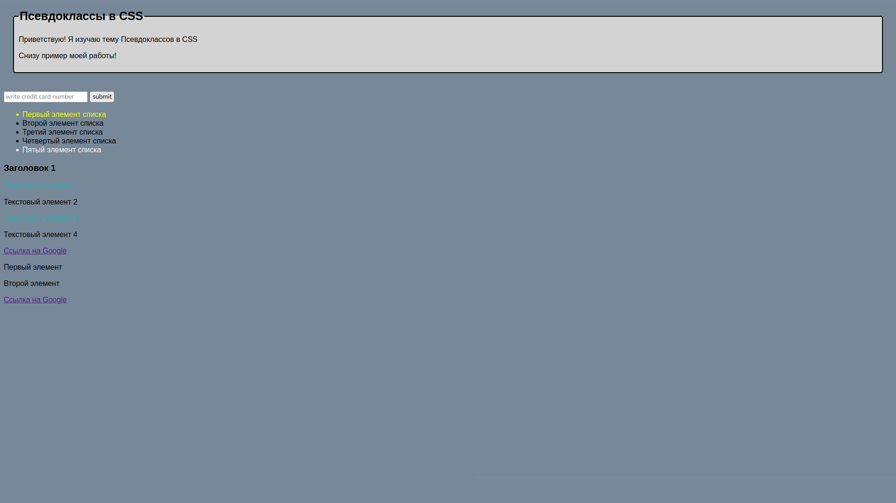

# Псевдоклассы в CSS

Учебный проект по теме **псевдоклассы CSS**.  
В проекте показаны примеры работы с `:hover`, `:focus`, `:first-child`, `:last-child`, `:nth-child` и их комбинацией.

---

## 📂 Содержание проекта
1. **Задание 1: Псевдоклассы hover и focus**
   - При наведении на кнопку (`:hover`) меняется цвет фона.
   - При фокусе на текстовом поле (`:focus`) изменяется цвет фона.

2. **Задание 2: Псевдоклассы first-child и last-child**
   - Первый элемент списка (`:first-child`) выделяется жёлтым цветом.
   - Последний элемент списка (`:last-child`) выделяется белым цветом.

3. **Задание 3: Применение псевдоклассов к разным элементам**
   - Ссылка изменяет цвет при наведении (`:hover`) и при фокусе (`:focus`).
   - Абзацы с нечётным порядком (`:nth-of-type(odd)`) окрашиваются в другой цвет.

4. **Задание 4: Комбинация псевдоклассов**
   - Первый элемент в блоке (`:first-child:hover`) меняет цвет при наведении.
   - Последний элемент в блоке (ссылка `:last-child:focus`) меняет цвет при получении фокуса.

---

## 🛠 Используемые технологии
- **HTML5**
- **CSS3**

---

## 📸 Пример работы
- Наведите курсор на кнопку → фон изменится.
- Нажмите `Tab` и перейдите к полю ввода → фон изменится.
- Перемещайтесь по ссылкам с помощью `Tab` → активная ссылка изменит цвет.
- Наведите курсор на первый элемент блока → текст изменит цвет.



---

## ⚡ Запуск проекта
Склонировать репозиторий:
```bash
git clone https://github.com/ВАШ_НИК/Псевдоклассы-CSS.git
```
```html
<!DOCTYPE html>
<html lang="en">

<head>
    <meta charset="UTF-8">
    <meta name="viewport" content="width=device-width, initial-scale=1.0">
    <title>Псевдоклассы в CSS</title>
    <link rel="stylesheet" href="styles.css">
</head>

<body>
    
    <div>
        <fieldset>
            <legend>Псевдоклассы в CSS</legend>
            <p>Приветствую! Я изучаю тему Псевдоклассов в CSS</p>
            <p>Снизу пример моей работы!</p>
        </fieldset>
    </div>

    <br>

    <!-- Задание 1: Псевдоклассы hover и focus -->
    <input type="text" class="text" placeholder="write credit card number">
    <button type="text" class="button">submit</button>

    <!-- Задание 2: Псевдоклассы first-child и last-child -->
    
    <ul>
        <li class="first-child">Первый элемент списка</li>
        <li>Второй элемент списка</li>
        <li>Третий элемент списка</li>
        <li>Четвертый элемент списка</li>
        <li class="last-child">Пятый элемент списка</li>
    </ul>

    <!-- Задание 3: Применение псевдоклассов к разным элементам -->
    <div class="nchild">
        <h3>Заголовок 1</h3>
        <p>Текстовый элемент 1</p>
        <p>Текстовый элемент 2</p>
        <p>Текстовый элемент 3</p>
        <p>Текстовый элемент 4</p>
        <a href="https://www.google.com" target="_blank" class="link-color">Ссылка на Google</a>
    </div>

    <!-- Задание 4: Комбинация псевдоклассов -->
    <div class="combo-block">
        <p>Первый элемент</p>
        <p>Второй элемент</p>
        <a href="https://www.google.com" target="_blank">Ссылка на Google</a>
    </div>

</body>

</html>
```
```css
body {
    font-family: Arial, sans-serif;
    background-color: lightslategray;
}

fieldset {
    border: 2px solid black;
    border-radius: 5px;
    padding: 10px;
    margin: 20px;
    background-color: lightgray;
}

legend {
    font-weight: bold;
    font-size: 25px;
}

/* Задание 1: Псевдоклассы hover и focus */
.button:hover {
    background-color: lightblue;
}

.text:focus {
    background-color: lightgreen;
}

/* Задание 2: Псевдоклассы first-child и last-child */
.first-child:first-child {
    color: yellow;
}

.last-child:last-child {
    color: white;
}

/* Задание 3: Применение псевдоклассов к разным элементам*/
.link-color:hover {
    color: orange;
}

.link-color:focus {
    color: white;
    background-color: lightcoral;
}

.nchild p:nth-of-type(odd) {
    color: lightseagreen;
}

/* Задание 4: Комбинирование псевдоклассов */
.combo-block p:first-child:hover {
    color: purple;
}

.combo-block a:last-child:focus {
    color: plum;
    background-color: black;
    padding: 3px;
    border-radius: 3px;
}
```
